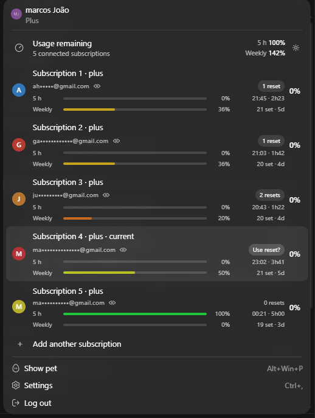
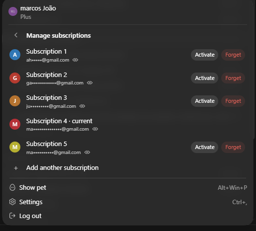

<div align="center">

# Codex Account Manager

**Live quota for all of your Codex subscriptions, inside the app's own account menu.**

Switch accounts in one click, reset quota from the panel, and land back in the
conversation you were in. Windows only.

<br>



<sub>Quota for every subscription, right in the account menu. Click one to switch to it.</sub>

<br><br>



<sub>The gear opens this: activate a saved subscription, or forget one.</sub>

</div>

---

## Install

```powershell
irm https://raw.githubusercontent.com/gbZyuuu/codex-account-manager/main/install.ps1 | iex
```

One line, nothing to clone. It asks for your language, installs Node.js and
Codex if they are missing, and creates a **Codex Account Manager** shortcut on
your Desktop and in the Start Menu. Open Codex through that shortcut.

## Using it

**Quota.** Each subscription shows two bars: the 5-hour window and the weekly
one, with the percentage left, the time the window resets and how long until
then. Bars go from green to red as the quota runs out. The header adds up all
connected subscriptions.

**Switch account.** Click a subscription. The app closes and reopens signed in
as that account, back in the conversation you were in.

**Reset quota.** When a subscription has resets available, the badge shows how
many (`1 reset`, `2 resets`). Click it and the badge turns into **`Use reset?`** —
click again to confirm. Two clicks on purpose: a reset is spent for good, and a
single misclick should not burn one.

**Hide the e-mail.** The eye next to each address shows or hides it, so you can
screenshot the panel without exposing your accounts.

**Manage subscriptions.** The gear opens the second panel shown above.
**Activate** switches to that subscription. **Forget** removes the saved
credential from the list; it never offers to forget the one currently in use,
because without a saved pair there would be no way back. **Add another
subscription** saves the current session, signs out and reopens on the login
screen, so a new account can be added without going through Settings.

## Is it safe

**The original app is never modified.** Codex from the Store lives in a folder
owned by the system, which cannot be written to without administrator rights,
and this installer never asks for them. It copies the app to
`%LOCALAPPDATA%\codex-account-manager` and changes the copy. The original stays
intact and keeps receiving Store updates.

**Your chats are not touched.** They live in `~/.codex`, together with the
sign-in data. The change happens inside the copied app's `resources/app.asar`.
Different places, so the change cannot reach them. The only thing that writes
to `~/.codex` is switching accounts, which backs up the current credential
before replacing it.

**The change is one field, and it is reversible.** Inside the archive there is a
`package.json` with a `main` field, and only that field changes, written in
place at the exact same length. The original bytes are backed up with the app
version and a hash before anything is written, and read back to validate right
after. If validation fails, it reverts in the same run. `uninstall` restores
those bytes.

## Commands

Run them as `node bin/cam.js <command>` from the folder the installer created
(`%LOCALAPPDATA%\codex-account-manager\source`).

| command | effect |
|---|---|
| `install` | copies the app if needed, patches, validates |
| `uninstall` | restores the original app and removes shortcuts and triggers |
| `doctor` | state, versions, whether the copy is out of date |
| `check [--apply]` | detects a Codex update; `--apply` re-copies and re-patches |
| `watch install\|remove\|status` | update triggers: logon + every 6h |
| `preflight` | read-only, writes nothing |

## Codex updates

A copy is a snapshot, and snapshots age. When Codex updates, the watcher rebuilds
the copy at the next logon, or within six hours. The installer turns it on for
you. If Codex is open at that moment, it waits for the next pass instead of
risking a half-written copy.

## Language

English by default. For Portuguese, set `CAM_LANG=pt`:

```powershell
$env:CAM_LANG = "pt"
node bin/cam.js doctor
```

## Requirements

Windows, Codex from the Microsoft Store, Node.js 18 or newer, and about 1.8 GB
free for the copy of the app. No npm dependencies and no build step.

## License

Free to use **and free to share**. See [LICENSE](LICENSE).

Use it, send it to people, post about it, recommend it. What you may not do is
present it as your own work, publish it under another name, or modify and
redistribute it. The line is authorship: spreading the word is encouraged,
taking credit is not.

Not affiliated with OpenAI. "Codex" and "ChatGPT" are trademarks of their
respective owners, named only to identify the program this works with.

---

<details>
<summary><b>Português</b></summary>

<br>

# Codex Account Manager

**Cota ao vivo de todas as suas assinaturas do Codex, dentro do próprio menu de
conta do aplicativo.**

Troca de conta em um clique, redefinição de cota pelo painel, e volta na
conversa onde você estava. Somente Windows.

## Instalação

```powershell
irm https://raw.githubusercontent.com/gbZyuuu/codex-account-manager/main/install.ps1 | iex
```

Uma linha, sem clonar nada. Ele pergunta seu idioma, instala o Node.js e o Codex
se estiverem faltando, e cria um atalho **Codex Account Manager** na Área de
Trabalho e no Menu Iniciar. Abra o Codex por esse atalho.

## Como usar

**Cota.** Cada assinatura mostra duas barras: a janela de 5 horas e a semanal,
com a porcentagem restante, o horário em que a janela reinicia e quanto falta.
As barras vão de verde a vermelho conforme a cota acaba. O cabeçalho soma todas
as assinaturas conectadas.

**Trocar de conta.** Clique numa assinatura. O aplicativo fecha e reabre logado
naquela conta, de volta na conversa onde você estava.

**Redefinir cota.** Quando a assinatura tem redefinições disponíveis, o selo
mostra quantas (`1 reset`, `2 resets`). Clique nele e o selo vira
**`Use reset?`** — clique de novo para confirmar. Dois cliques de propósito: uma
redefinição é gasta para sempre, e um clique errado não deve queimar uma.

**Esconder o e-mail.** O olhinho ao lado de cada endereço mostra ou esconde,
para você poder tirar print do painel sem expor suas contas.

**Gerenciar assinaturas.** A engrenagem abre o segundo painel mostrado no topo.
**Activate** troca para aquela assinatura e **Forget** remove a credencial salva da
lista. Ele nunca oferece esquecer a que está em uso, porque sem um par salvo não
haveria como voltar. **Add another subscription** salva a sessão atual, sai da conta
e reabre na tela de login, para adicionar uma conta nova sem passar pelas
Configurações.

## É seguro

**O aplicativo original nunca é modificado.** O Codex da Loja fica numa pasta
que pertence ao sistema, onde não se escreve sem direitos de administrador, e
este instalador nunca os pede. Ele copia o aplicativo para
`%LOCALAPPDATA%\codex-account-manager` e altera a cópia. O original continua
intacto e continua recebendo atualizações da Loja.

**Seus chats não são tocados.** Eles ficam em `~/.codex`, junto com os dados de
login. A alteração acontece dentro do `resources/app.asar` da cópia. São lugares
diferentes, então a alteração não os alcança. A única coisa que escreve em
`~/.codex` é a troca de conta, que faz backup da credencial atual antes de
substituir.

**A alteração é um campo, e é reversível.** Dentro do arquivo existe um
`package.json` com o campo `main`, e só esse campo muda, escrito no lugar com
exatamente o mesmo tamanho. Os bytes originais são guardados com a versão do
aplicativo e um hash antes de qualquer escrita, e lidos de volta para validar
logo depois. Se a validação falhar, ele reverte na mesma execução. O `uninstall`
restaura esses bytes.

## Comandos

Rode como `node bin/cam.js <comando>` na pasta que o instalador criou
(`%LOCALAPPDATA%\codex-account-manager\source`).

| comando | efeito |
|---|---|
| `install` | copia o aplicativo se preciso, altera, valida |
| `uninstall` | restaura o original e remove atalhos e gatilhos |
| `doctor` | estado, versões, se a cópia está desatualizada |
| `check [--apply]` | detecta atualização do Codex; `--apply` recopia e reaplica |
| `watch install\|remove\|status` | gatilhos de atualização: logon + a cada 6h |
| `preflight` | somente leitura, não escreve nada |

## Atualizações do Codex

Uma cópia é um retrato, e retrato envelhece. Quando o Codex atualiza, o vigia
refaz a cópia no próximo logon, ou dentro de seis horas. O instalador liga isso
para você. Se o Codex estiver aberto na hora, ele espera a próxima passada em vez
de arriscar deixar a cópia pela metade.

## Idioma

Inglês por padrão. Para português, defina `CAM_LANG=pt`.

## Requisitos

Windows, Codex da Microsoft Store, Node.js 18 ou mais novo, e cerca de 1,8 GB
livres para a cópia do aplicativo. Sem dependências de npm e sem passo de build.

## Licença

Livre para usar **e livre para compartilhar**. Veja [LICENSE](LICENSE).

Use, envie para as pessoas, poste, recomende. O que não pode é apresentar como
trabalho seu, publicar sob outro nome, ou modificar e redistribuir. A linha é a
autoria: divulgar é incentivado, tomar o crédito não é.

Não é afiliado à OpenAI. "Codex" e "ChatGPT" são marcas de seus respectivos
titulares, citadas apenas para identificar o programa com o qual isto funciona.

</details>
